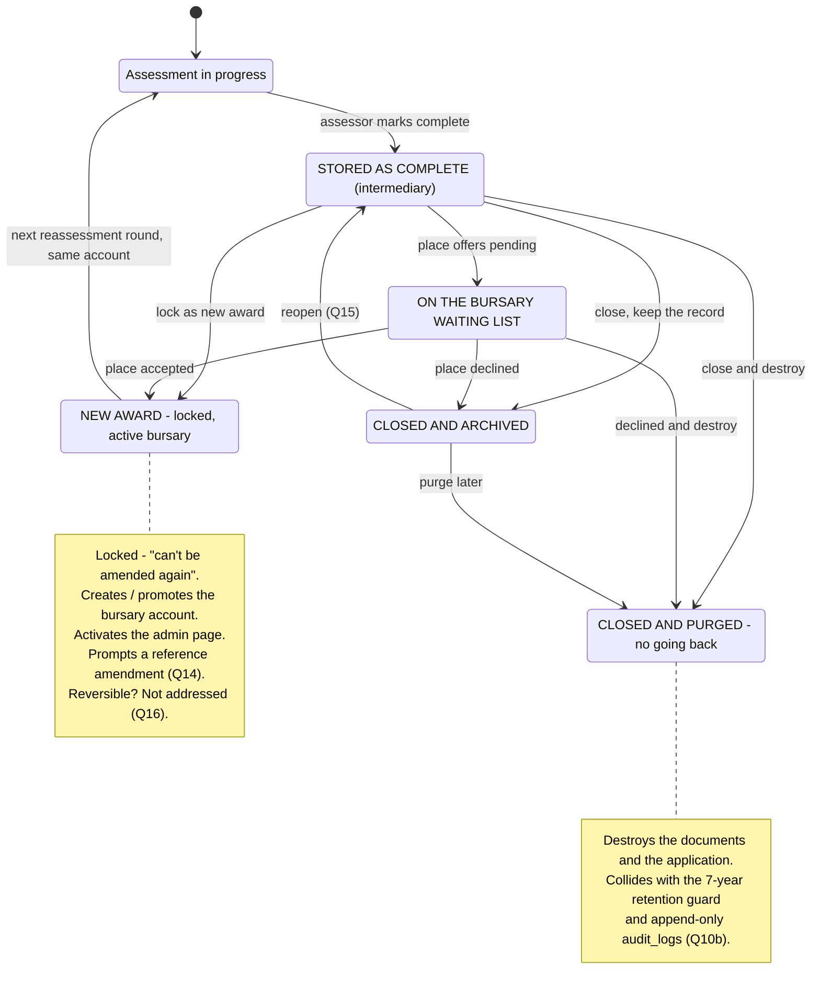

# Post-assessment lifecycle — the state machine

**Purpose.** Charlotte approved five post-assessment states on 25 Aug (*"Yes
let's go ahead and use those"*) and illustrated them on 26 Aug. The states are
agreed; **the transitions, the guards and the side effects are not.** This draws
them so she can correct one picture rather than us building a guess at a
workflow that governs awards and irreversible deletion.

**Scope.** This revises the **decision track** only. The Application track
(§3 of [`state-model.md`](../product/state-model.md)) and the Assessment work
track (Not Started → In Progress → Paused → Complete, §4) are unchanged, and so
is the Bursary Account track's Active/Closed pair (§5). Where this document and
[`bursary-application-flow.drawio`](./bursary-application-flow.drawio) disagree
on the pre-decision topology, **the diagram still wins.**

> ⚠️ **Nothing here is built.** This is the WP-B1 deliverable — a diagram and a
> question list. Lane B's build (WP-B2…B7) starts after she answers.

---

## 1. The picture

Every state above is a state of the **assessment**. The loop from **New Award**
back to *Assessment in progress* is her *"assessment one"* framing: the next
round opens a **new** assessment against the **same** bursary account, and all
of them feed one admin page per account.

---

## 2. Every transition, on the five dimensions that matter

The plan requires each transition to be explicit about what locks, whether an
email fires, whether an account is created, whether it is reversible, and what
it destroys. **"?" is a question for her, not an omission.**

| # | Transition | What locks | Email? | Account? | Reversible? | Destroys |
|---|---|---|---|---|---|---|
| 1 | Assessing → **Stored as complete** | assessment figures freeze for review; still amendable | **none** — she was explicit: *"we don't send emails from the assessment completion"* | no | yes — reopen to In Progress exists today | nothing |
| 2 | Stored → **New Award** | *"the assessment is locked, finalised, can't be amended again"* | **Q11** | **yes** — Q12 answered: created/promoted here, and this activates the admin page | **Q16** (new — see below) | nothing |
| 3 | Stored → **Waiting list** | nothing — held pending admissions | **Q11** (does she tell the family they are on a list?) | no | yes, implicitly — it is a holding state | nothing |
| 4 | Stored → **Closed & archived** | *"the assessment status shows as closed"*; record retained | **Q11** | no | **Q15** | nothing |
| 5 | Stored → **Closed & purged** | terminal | **Q11** | no | **no** — *"no going back"* | **Q10 answered:** the documents and the application |
| 6 | Waiting list → **New Award** | as #2 | as #2 | as #2 | as #2 | nothing |
| 7 | Waiting list → **Closed** (archived or purged) | as #4 / #5 | **Q11** | no | as #4 / #5 | as #4 / #5 |
| 8 | Archived → **Stored** (reopen) | unlocks for amendment | none | no | — | nothing |
| 9 | Archived → **Purged** | terminal | none | no | no | as #5 |
| 10 | New Award → **next round** | new assessment on the same account | existing invitation flow | no — reuses the account | n/a | nothing |

### Dimension notes

**What locks (#2).** *"Can't be amended again"* needs a concrete reading before
it can be built. Our proposal, to be confirmed: the assessment's figures, its
reason codes and its recommendation become read-only; the **application** data
stays editable via the audited CR-001 edit-on-behalf path (a factual correction
to an address should not require unlocking an award); and the schedule stays
managed, because forward years are administered after the award, not frozen by
it.

**Email (#2–#7) — Q11 is the sharp one.** Today the outcome email fires on
recording an outcome (`set-outcome-core.ts`), which she says is not her process.
There are three possible answers and they are materially different:

1. it moves to the **New Award** transition, and the other four states send
   nothing;
2. it stops entirely — **in which case nobody is ever told**, and the templates
   `OUTCOME_AWARDED`, `OUTCOME_QUALIFIES_NOT_AWARDED` and `OUTCOME_DNQ` become
   dead;
3. it becomes **manual** — a "notify the family" action she triggers when the
   admissions position is settled, which fits *"the winter admission process"*
   better than any automatic trigger.

We would recommend **(3)** if she has no strong view: it matches a process where
the school's decision and the bursary decision land at different times, and it
never sends on a state she is only parking a case in.

**Account (#2).** Q12 answered. This also fixes CH-49's caveat:
`completeAssessmentAction` early-returns on `!bursaryAccountId`, which is why a
first-time applicant's Assessment Admin tables stay empty. Creating the account
at a defined moment gives the schedule mirror something to write to.

---

## 3. Two facts that change what Q14 is even asking

Q14 was written as *"is the assessor editing an existing reference, or minting
one?"*, and both the Epic 18 spec and the implementation plan describe account
references as uniqueness-validated. **Checked against the code on 26 Aug, both
premises are wrong:**

1. **A bursary account has no user-facing reference at all.**
   `account-promotion.ts:118` — *"No reference is minted for the account (Epic
   13, D13-1a): it is an internal FK; the user-facing label lives on
   `Application.reference`."* So *"amend the bursary account reference"* can only
   mean the **application** reference.
2. **References are not unique any more.**
   `edit-reference-dialog.tsx:12` — *"Since D13-1a the reference is NOT unique —
   duplicates are accepted, because the value is edited to match the external
   fees system."* The plan's *"references are uniqueness-validated"* is stale.

And the editor **already exists**: `EditReferenceDialog` is an **ADMIN-only**
affordance, available at any point with no state-gating, rendered from the
application header (the pencil beside the reference).

So WP-B3 does not need to build an editor. What it needs is a **prompt** at the
New Award transition — and Q14 reduces to three much smaller questions:

- Is the prompt **blocking** (must confirm or change the reference before the
  award locks) or **advisory** (a dismissible nudge)?
- Should the prompt **pre-fill a suggested value**, or show the current one?
- She wrote *"prompt asking the **assessor**"* — but the editor is **ADMIN-only**
  today. Should an ASSESSOR be able to change it, or does the prompt tell them to
  ask an admin?

---

## 4. Q10b — the purge reconciliation, in concrete terms

Her governing principle: *"not destroy everything if we say to parents that we
do."* Three things currently stand between that and a purge, and each needs a
written position before WP-B6 is built.

| Obstacle | Where | Options |
|---|---|---|
| **7-year retention guard** on the GDPR delete path | the existing tiered-retention policy (D6), purge step gated by `RETENTION_PURGE_ENABLED` (currently unset → report-only) | (a) purge-on-decision overrides the clock; (b) purge *starts* the clock and the destruction happens at its end; (c) the retention years are shortened for never-awarded applications |
| **`audit_logs` is append-only** — `DELETE` is denied (42501) even under `service_role` | schema-level, by design | (a) show the trail holds nothing identifying and keep it; (b) anonymise the identifying columns in place; (c) revisit the append-only guarantee — **least preferred**, it is a control |
| **DPO has not signed off the retention years** (D6) | outstanding since the process-alignment programme | needed regardless of Epic 18 |

The honest framing for her: a purge can destroy **the documents and the
application data**. It cannot destroy **the fact that an application existed**,
because the audit trail is deliberately immutable. If the privacy notice implies
otherwise, the notice is what needs adjusting — and that is her call, not a
technical one.

---

## 5. What this implies for the build, and one hard ordering rule

> **WP-B7 (remove the three decision buttons) cannot land before WP-B3 (New
> Award).** Removing them first leaves no way to finish an assessment at all —
> nothing locks, no outcome is recorded, no account is created.

| WP | Depends on | Note |
|---|---|---|
| **B2** Stored as complete | — | Almost certainly a **relabel** of `AssessmentStatus.COMPLETED` + the CH-05 strip's COMPLETE state. Confirm before adding an enum value. |
| **B3** New Award | **Q11**, **Q14**, and §2's "what locks" reading | Also fixes CH-49's empty Assessment Admin tables |
| **B4** Waiting list | Q11 | A state of the assessment, alongside the other finals |
| **B5** Closed & archived | **Q15** | Reopen-to-stored only if she says so |
| **B7** Remove the three buttons | **after B3** | Hard rule above |
| **B6** Closed & purged | **Q10b in writing**, and B2–B5 landed | **Last.** Behind the existing two-step confirmation |

**Enum warning for every one of these:** never write a new enum value to
production before the code that knows it is deployed — the running Prisma client
is generated from the old schema and throws on deserialising an unknown member.
And before widening any Prisma enum, `grep 'case "<value>"'`: four modules once
kept private switches with `default: return null`, so a new value fell through
to a fallback with no error.

---

## 6. The open questions, in the order worth asking

| # | Question | Blocks | Why it matters |
|---|---|---|---|
| **Q11** | Does the outcome email stop, move to New Award, or become a manual "notify" action? *(we suggest manual)* | B3, B4, B5 | **If it simply stops, nobody is ever told.** Three live templates become dead. |
| **Q14** | The reference prompt at New Award: blocking or advisory? Pre-filled? And may an ASSESSOR edit, or only an ADMIN? | B3 | The editor already exists and references are not unique — see §3 |
| **Q15** | Is **closed & archived** reopenable, back to *stored*? | B5 | Her earlier sketch had closed → stored; the illustration is silent, and there are now two "closed" states |
| **Q16** | 🆕 Is **New Award** reversible? *"Can't be amended again"* implies terminal — but a genuine error after locking currently has no route back | B3 | Terminal-with-no-escape is a support problem the first time it is wrong |
| **Q10b** | Purge vs the 7-year retention guard, and append-only `audit_logs` — see §4 | B6 | The one transition whose wrong behaviour cannot be undone |

**Q16 is new.** It falls out of drawing the diagram: every other final state has
an exit, and New Award has none. That may be exactly what she wants — but it
should be a decision, not an accident of the sketch.
