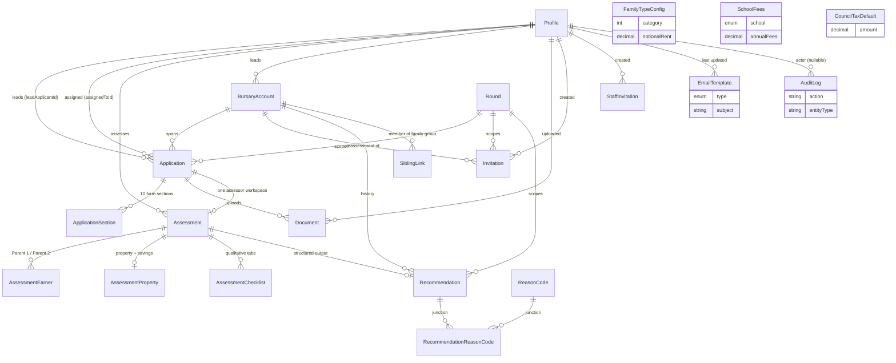

# Data Model & ERD

A human-readable reference for the JWF Bursary System database: entities,
relationships, enums, and the Row-Level Security (RLS) model. The **source of
truth** is [`prisma/schema.prisma`](../../prisma/schema.prisma) (535 lines);
the live shape was cross-checked against `supabase-nonprod` while writing this
document. Where this doc and the schema ever disagree, the schema wins — and
the disagreement is a bug to be filed.

> **New to Supabase?** A few terms recur throughout. Plain definitions, once:
>
> - **`auth.users`** — Supabase Auth's own table of login identities (email,
>   password hash, `app_metadata`, MFA factors). It lives in the `auth` schema,
>   not `public`. Our [`Profile`](#profile) rows share the same UUID primary key
>   as the matching `auth.users` row — that is the join between "who logged in"
>   and "what they can do in the app".
> - **`auth.mfa_factors` / `aal2`** — Supabase stores enrolled multi-factor
>   (TOTP) devices in `auth.mfa_factors`. A session that has passed an MFA
>   challenge is at **Assurance Level 2 (`aal2`)**; a password-only session is
>   `aal1`. Staff routes require `aal2` (see the API reference).
> - **Row-Level Security (RLS)** — a Postgres feature where the database itself
>   filters which *rows* a query can see or change, based on policies attached
>   to each table. It is enforced by the engine, below the application, so a
>   bug in app code cannot leak another family's data. Our policy model is in
>   [§ RLS model](#row-level-security-rls-model).
> - **Storage bucket** — Supabase Storage keeps uploaded files (here: the
>   `documents` bucket) in object storage with its own RLS on `storage.objects`.
>   Files are never public; access is via short-lived signed URLs.
> - **Connection poolers** — Supabase fronts Postgres with two PgBouncer
>   endpoints. The **transaction pooler (port 6543)** is used at runtime
>   (`DATABASE_URL`); the **session pooler (port 5432)** is used for migrations
>   (`DIRECT_URL`), because migrations need a stable session for advisory locks
>   and `CREATE TYPE`/`ALTER TYPE`.

See also: [`tdd/06-data-design.md`](tdd/06-data-design.md).

---

## Entity-relationship diagram

Reference tables (`FamilyTypeConfig`, `SchoolFees`, `CouncilTaxDefault`) and
`EmailTemplate` / `AuditLog` carry no foreign keys into the application graph
(except `AuditLog.userId` and `EmailTemplate.updatedBy` → `Profile`, both
nullable), so they are shown standalone above to keep the diagram legible.

---

## Entities

Column names below are the **Prisma field names**; the physical Postgres column
is the `@map(...)` value where one exists (e.g. `leadApplicantId` →
`lead_applicant_id`). All tables use `@@map` to a snake_case plural table name.
Primary keys are UUIDs (`@default(uuid())`, `@db.Uuid`) and timestamps are
`timestamptz(6)` unless noted.

### Profile

`profiles` — extends a Supabase `auth.users` record with application data.
([schema.prisma:13](../../prisma/schema.prisma#L13))

| Column | Type | Notes |
|---|---|---|
| `id` | UUID PK | **Equals `auth.users.id`.** Not generated independently in practice — set to the auth user's id at creation. |
| `role` | `Role` | Default `APPLICANT`. A DB trigger mirrors this into `auth.users.app_metadata.role` (see below). |
| `email` | String | `@unique`. Anonymised to `[deleted-<uuid>]@removed.invalid` on GDPR erasure. |
| `firstName`, `lastName`, `phone` | String? | Nulled on GDPR erasure. |
| `createdAt`, `updatedAt` | timestamptz | |

Relations: lead/assigned `Application[]`, owned `Assessment[]`, `BursaryAccount[]`,
uploaded `Document[]`, created `Invitation[]` / `StaffInvitation[]`, updated
`EmailTemplate[]`, `AuditLog[]`.

**Role → JWT sync.** Migration
[`20260302000000_sync_role_to_app_metadata`](../../prisma/migrations/20260302000000_sync_role_to_app_metadata/migration.sql)
installs trigger `trg_sync_role_to_app_metadata` (AFTER INSERT OR UPDATE OF
`role`), a `SECURITY DEFINER` function that writes `raw_app_meta_data.role` on
`auth.users`. This is why the edge middleware can read a user's role straight
from the JWT without a database round-trip, and why `updateStaffRoleAction`
needs no explicit Supabase call to propagate a role change.

### Round

`rounds` — one assessment cycle per academic year.
([schema.prisma:36](../../prisma/schema.prisma#L36))

| Column | Type | Notes |
|---|---|---|
| `academicYear` | String | `@unique`, format `YYYY/YY` (e.g. `2026/27`). |
| `openDate`, `closeDate` | Date | Close must be after open (enforced in the action's Zod refine). |
| `decisionDate` | Date? | Optional; must be after close. |
| `status` | `RoundStatus` | `DRAFT` → `OPEN` → `CLOSED`. "Only one OPEN at a time" is enforced at the action layer, not by a DB constraint. |

Relations: `Application[]`, `Invitation[]`, `Recommendation[]`.

### BursaryAccount

`bursary_accounts` — a **persistent account per child**, spanning multiple
assessment years; created when an application first `QUALIFIES`.
([schema.prisma:52](../../prisma/schema.prisma#L52))

| Column | Type | Notes |
|---|---|---|
| `reference` | String | `@unique`. |
| `school` | `School` | `TRINITY` \| `WHITGIFT`. |
| `childName`, `childDob` | String / Date? | |
| `entryYear` | Int | Entry **calendar** year. |
| `entryYearGroup` | `EntryYearGroup?` | Drives schooling-years calc (see enum). |
| `firstAssessmentYear` | String | Academic year of the first qualifying assessment. |
| `benchmarkPayableFees` | Decimal(10,2)? | Carried from the first assessment's yearly payable fees. |
| `leadApplicantId` | UUID FK → Profile | Indexed. |
| `status` | `BursaryAccountStatus` | `ACTIVE` \| `CLOSED`; `closedAt` set on close. |

Relations: `Application[]`, `Invitation[]`, `Recommendation[]`, `SiblingLink[]`.

### Application

`applications` — **one application per child per round**.
([schema.prisma:78](../../prisma/schema.prisma#L78))

| Column | Type | Notes |
|---|---|---|
| `reference` | String | `@unique`. Prefixes: first-year `<SCHOOL>-…`, re-assessment `REA-…`, internal `INT-…`. |
| `roundId` | UUID FK → Round | |
| `bursaryAccountId` | UUID? FK → BursaryAccount | Null until QUALIFIES; set for re-assessments. |
| `leadApplicantId` | UUID FK → Profile | Relation `ApplicationLeadApplicant`. |
| `assignedToId` | UUID? FK → Profile | The assessor; relation `ApplicationAssignee`. The RLS pivot for assessor access. |
| `school`, `childName`, `childDob`, `entryYear`, `entryYearGroup` | — | `entryYearGroup`/`entryYear` are promoted from section JSONB to columns at submit (or set at internal-request creation). |
| `isReassessment`, `isInternal` | Boolean | Default false. |
| `status` | `ApplicationStatus` | Default `PRE_SUBMISSION`. Lifecycle below. |
| `submittedAt` | timestamptz? | Set at submit; basis of the 7-year GDPR retention guard. |

Constraints / indexes: `@@unique([roundId, leadApplicantId, childName])`;
indexes on `[roundId, status]`, `leadApplicantId`, `bursaryAccountId`,
`assignedToId`.

**Status lifecycle** (`ApplicationStatus`): the applicant portal owns
`PRE_SUBMISSION → SUBMITTED`; the assessor side then drives
`SUBMITTED → NOT_STARTED → {PAUSED ⇄ NOT_STARTED} → COMPLETED →
{QUALIFIES | DOES_NOT_QUALIFY}`. The legal transitions are encoded in
`VALID_TRANSITIONS` in the applications actions file.

### ApplicationSection

`application_sections` — applicant-entered form data, **one row per section**,
stored as JSONB. ([schema.prisma:113](../../prisma/schema.prisma#L113))

| Column | Type | Notes |
|---|---|---|
| `applicationId` | UUID FK → Application | `onDelete: Cascade`. |
| `section` | `ApplicationSectionType` | 10 section types. |
| `data` | Json | `@default("{}")`. Validated per-section by Zod on save. |
| `isComplete` | Boolean | All 10 must be true to submit. |

Constraint: `@@unique([applicationId, section])` — one row per section per app.

### Document

`documents` — metadata for uploaded files; the file bytes live in the Supabase
`documents` Storage bucket. ([schema.prisma:127](../../prisma/schema.prisma#L127))

| Column | Type | Notes |
|---|---|---|
| `applicationId` | UUID FK → Application | `onDelete: Cascade`. |
| `slot` | String | Slot identifier (e.g. `BIRTH_CERTIFICATE`). |
| `filename`, `mimeType`, `fileSize` | — | MIME is the server-verified (magic-byte sniffed) type, not the client's. |
| `storagePath` | String | `documents/{applicationId}/{slot}/{uuid}_{filename}`. The first path segment is the applicationId — Storage RLS keys off it. |
| `isVerified` | Boolean | Toggled by assessors. |
| `uploadedBy` | UUID FK → Profile | |

Index: `@@index([applicationId, slot])`.

### Assessment

`assessments` — the **core assessor workspace**: all financial inputs and
calculation outputs for one application. ([schema.prisma:146](../../prisma/schema.prisma#L146))

| Group | Columns |
|---|---|
| Link | `applicationId` (UUID FK, `@unique`, cascade), `assessorId` (UUID FK → Profile) |
| Family-type costs | `familyTypeCategory`, `notionalRent`, `utilityCosts`, `foodCosts`, `annualFees`, `councilTax` |
| Income / assets | `schoolingYearsRemaining`, `totalHouseholdNetIncome`, `netAssetsYearlyValuation`, `hndiAfterNs` |
| Bursary calc | `requiredBursary`, `grossFees`, `scholarshipPct` (def 0), `bursaryAward`, `netYearlyFees`, `vatRate` (def 20.00), `yearlyPayableFees`, `monthlyPayableFees` |
| Manual override | `manualAdjustment` (def 0), `manualAdjustmentReason` |
| Property | `propertyCategory`, `propertyExceedsThreshold` |
| Flags | `dishonestyFlag`, `creditRiskFlag` |
| State | `status` (`AssessmentStatus`, def `NOT_STARTED`), `outcome` (`AssessmentOutcome?`), `completedAt` |

All money fields are `Decimal(10,2)`; percentages `Decimal(5,2)`.
Relations: `AssessmentEarner[]`, `AssessmentProperty?`, `AssessmentChecklist[]`,
`Recommendation?`.

### AssessmentEarner

`assessment_earners` — income breakdown per earner.
([schema.prisma:190](../../prisma/schema.prisma#L190))

| Column | Type | Notes |
|---|---|---|
| `assessmentId` | UUID FK → Assessment | cascade |
| `earnerLabel` | `EarnerLabel` | `PARENT_1` \| `PARENT_2` |
| `employmentStatus` | `EmploymentStatus` | |
| `netPay`, `netDividends`, `netSelfEmployedProfit`, `pensionAmount`, `benefitsIncluded`, `benefitsExcluded`, `totalIncome` | Decimal(10,2) | default 0 |
| `benefitsIncludedDetail`, `benefitsExcludedDetail` | Json | per-benefit breakdown, `@default("{}")` |

Constraint: `@@unique([assessmentId, earnerLabel])` — at most one row per parent.

### AssessmentProperty

`assessment_properties` — property and savings data for Stage 2.
([schema.prisma:213](../../prisma/schema.prisma#L213)) One-to-one with Assessment
(`assessmentId @unique`, cascade).

`isMortgageFree`, `additionalPropertyCount`, `additionalPropertyIncome`,
`cashSavings`, `isasPepsShares`, `schoolAgeChildrenCount` (def 1),
`derivedSavingsAnnualTotal`.

### AssessmentChecklist

`assessment_checklists` — qualitative context tabs with free-text notes.
([schema.prisma:231](../../prisma/schema.prisma#L231))

`assessmentId` (FK, cascade), `tab` (`ChecklistTab`), `notes` (def `""`).
Constraint `@@unique([assessmentId, tab])`.

### Recommendation

`recommendations` — structured recommendation output per assessment.
([schema.prisma:244](../../prisma/schema.prisma#L244))

| Column | Type | Notes |
|---|---|---|
| `assessmentId` | UUID FK → Assessment | `@unique`, cascade |
| `bursaryAccountId` | UUID? FK → BursaryAccount | history link |
| `roundId` | UUID FK → Round | |
| `familySynopsis`, `accommodationStatus`, `incomeCategory`, `summary` | String? | narrative |
| `propertyCategory` | Int? | |
| `bursaryAward`, `yearlyPayableFees`, `monthlyPayableFees` | Decimal(10,2)? | may override the assessment figures |
| `dishonestyFlag`, `creditRiskFlag` | Boolean | |

Relation: `RecommendationReasonCode[]`.

### ReasonCode & RecommendationReasonCode

`reason_codes` ([schema.prisma:270](../../prisma/schema.prisma#L270)) — reference
list for year-on-year change reasons: `code` (Int `@unique`), `label`,
`isDeprecated`, `sortOrder`.

`recommendation_reason_codes`
([schema.prisma:283](../../prisma/schema.prisma#L283)) — the many-to-many junction
between Recommendation and ReasonCode. Composite PK
`@@id([recommendationId, reasonCodeId])`; the recommendation side cascades on
delete.

### SiblingLink

`sibling_links` — links bursary accounts into a **family group** for sequential
income absorption. ([schema.prisma:294](../../prisma/schema.prisma#L294))

| Column | Type | Notes |
|---|---|---|
| `familyGroupId` | UUID | groups sibling accounts (no separate `FamilyGroup` table — see note) |
| `bursaryAccountId` | UUID FK → BursaryAccount | |
| `priorityOrder` | Int | absorption order within the group |

Constraints: `@@unique([familyGroupId, bursaryAccountId])`,
`@@unique([familyGroupId, priorityOrder])`.

> **Note — there is no `FamilyGroup` entity.** A "family group" is just a shared
> `familyGroupId` UUID across `SiblingLink` rows; it is not a table of its own.
> The grouping is created/managed via the siblings API
> (`/api/siblings*`) and the helpers in `src/lib/db/queries/siblings.ts`.

### Reference tables

| Model / table | Purpose | Key columns | Versioning |
|---|---|---|---|
| `FamilyTypeConfig` / `family_type_configs` | Notional rent / utilities / food per family-type category | `category`, `description`, `notionalRent`, `utilityCosts`, `foodCosts`, `effectiveFrom` | `@@unique([category, effectiveFrom])` — new row per change, never update in place |
| `SchoolFees` / `school_fees` | Annual fees (pre-VAT) per school | `school`, `annualFees`, `effectiveFrom` | `@@unique([school, effectiveFrom])` |
| `CouncilTaxDefault` / `council_tax_defaults` | Default council tax (Band D Croydon) | `amount`, `description` (def "Band D Croydon"), `effectiveFrom` | versioned insert; no unique constraint |

These are seeded idempotently by `npm run seed:reference` (see project
`CLAUDE.md`). The settings actions **insert new versioned rows** rather than
mutating existing ones, so historical assessments remain reproducible.

### Invitation

`invitations` — applicant invitations (first-year, re-assessment, internal).
([schema.prisma:346](../../prisma/schema.prisma#L346))

| Column | Type | Notes |
|---|---|---|
| `email`, `applicantName`, `firstName`, `lastName`, `childName`, `school` | — | prefill for registration |
| `roundId`, `bursaryAccountId` | UUID? FK | `bursaryAccountId` set ⇒ this is a re-assessment invite |
| `authUserId` | UUID? | the pre-provisioned `auth.users` id (silent-invite pattern) |
| `token` | String `@unique` | single-use base64url token; the registration credential |
| `status` | `InvitationStatus` | `PENDING` → `ACCEPTED` / `EXPIRED` |
| `expiresAt`, `acceptedAt` | timestamptz | 30-day TTL |
| `createdBy` | UUID FK → Profile | relation `InvitationCreator` |

Indexes on `token` and `email`.

### StaffInvitation

`staff_invitations` — staff invitations (ASSESSOR / VIEWER), kept separate from
applicant invitations so the shapes stay clean.
([schema.prisma:375](../../prisma/schema.prisma#L375))

`email`, `role` (`Role`), `firstName`, `lastName`, `token` (`@unique`),
`authUserId` (UUID, **non-null** here), `status`, `expiresAt`, `acceptedAt`,
`createdBy` (FK → Profile, relation `StaffInvitationCreator`). Indexes on
`token` and `email`.

### EmailTemplate

`email_templates` — configurable transactional templates with merge fields.
([schema.prisma:396](../../prisma/schema.prisma#L396))

`type` (`EmailTemplateType` `@unique`), `subject`, `body`, `mergeFields` (Json),
`updatedBy` (UUID? FK → Profile), `updatedAt`.

> **Single source of truth for content:** rows are seeded by the
> `*_seed_email_templates` migration, **not** by `seed:reference` (per project
> `CLAUDE.md`). Merge tokens are snake_case (`{{applicant_name}}` etc.); a
> drift fix migration (`20260519161500_fix_email_template_merge_fields`)
> scrubbed any camelCase tokens.

### AuditLog

`audit_logs` — immutable, append-only audit trail.
([schema.prisma:410](../../prisma/schema.prisma#L410))

| Column | Type | Notes |
|---|---|---|
| `userId` | UUID? FK → Profile | the actor; nullable (system rows, or after GDPR anonymisation) |
| `action` | String | free-form action key (see the API reference for the catalogue) |
| `entityType` | String | PascalCase model name, e.g. `Application` |
| `entityId` | UUID? | |
| `context` | String? | human-readable line |
| `metadata` | Json | `@default("{}")` |

Indexes: `[entityType, entityId]`, `[userId, createdAt]`. The table is
INSERT-only at the database level for the runtime role — see RLS below.

---

## Enum catalogue

Every enum in the schema, with its values. Verified against `supabase-nonprod`.

| Enum | Values | Used by |
|---|---|---|
| `Role` | `APPLICANT`, `ASSESSOR`, `VIEWER`, `DELETED`, `ADMIN` | `Profile.role`, `StaffInvitation.role` |
| `School` | `TRINITY`, `WHITGIFT` | `BursaryAccount`, `Application`, `SchoolFees`, `Invitation` |
| `EntryYearGroup` | `Y6`, `Y7`, `Y9`, `Y12`, `OTHER` | `Application`, `BursaryAccount` — drives schooling years (Y6→7, Y7→6, Y9→4, Y12→1; `OTHER` = manual) |
| `RoundStatus` | `DRAFT`, `OPEN`, `CLOSED` | `Round.status` |
| `ApplicationStatus` | `PRE_SUBMISSION`, `SUBMITTED`, `NOT_STARTED`, `PAUSED`, `COMPLETED`, `QUALIFIES`, `DOES_NOT_QUALIFY` | `Application.status` |
| `AssessmentStatus` | `NOT_STARTED`, `PAUSED`, `COMPLETED` | `Assessment.status` |
| `AssessmentOutcome` | `QUALIFIES`, `DOES_NOT_QUALIFY` | `Assessment.outcome` |
| `EarnerLabel` | `PARENT_1`, `PARENT_2` | `AssessmentEarner.earnerLabel` |
| `EmploymentStatus` | `PAYE`, `BENEFITS`, `SELF_EMPLOYED_DIRECTOR`, `SELF_EMPLOYED_SOLE`, `OLD_AGE_PENSION`, `PAST_PENSION`, `UNEMPLOYED` | `AssessmentEarner.employmentStatus` |
| `ChecklistTab` | `BURSARY_DETAILS`, `LIVING_CONDITIONS`, `DEBT`, `OTHER_FEES`, `STAFF`, `FINANCIAL_PROFILE` | `AssessmentChecklist.tab` |
| `ApplicationSectionType` | `CHILD_DETAILS`, `FAMILY_ID`, `PARENT_DETAILS`, `DEPENDENT_CHILDREN`, `DEPENDENT_ELDERLY`, `OTHER_INFO`, `PARENTS_INCOME`, `ASSETS_LIABILITIES`, `ADDITIONAL_INFO`, `DECLARATION` | `ApplicationSection.section` (the 10 portal sections) |
| `InvitationStatus` | `PENDING`, `ACCEPTED`, `EXPIRED` | `Invitation.status`, `StaffInvitation.status` |
| `EmailTemplateType` | `INVITATION`, `CONFIRMATION`, `MISSING_DOCS`, `OUTCOME_QUALIFIES`, `OUTCOME_DNQ`, `REASSESSMENT`, `REMINDER`, `INVITE_STAFF` | `EmailTemplate.type` |
| `BursaryAccountStatus` | `ACTIVE`, `CLOSED` | `BursaryAccount.status` |

`DELETED` (Role) is a tombstone applied by GDPR erasure / staff deactivation;
the middleware signs such users out. `INVITE_STAFF` (EmailTemplateType) was
added after the initial schema by migration `20260513184725_add_staff_invitation_enum`.

---

## Row-Level Security (RLS) model

RLS is the **third defence layer** (after middleware route guards and
application-level role checks). It is enforced inside Postgres, so even a flawed
query or an injection that reaches the database cannot return rows the current
user is not entitled to.

### The runtime role and how user context is set

The Prisma runtime does **not** connect as a Postgres superuser. Migration
[`20260513090020_enable_row_level_security`](../../prisma/migrations/20260513090020_enable_row_level_security/migration.sql)
creates a non-superuser login role **`app_user`** (`NOINHERIT`, no
`BYPASSRLS`), granted only the CRUD it needs per table. `DATABASE_URL` connects
as this role at runtime.

Because `app_user` has no superuser powers, every RLS policy must be satisfied
on its merits. The application tells the database *who* the current user is by
setting a transaction-local claim. Both wrappers live in
[`src/lib/db/prisma.ts`](../../src/lib/db/prisma.ts):

- **`withUserContext(userId, role, fn)`** opens a transaction and runs
  `SET LOCAL request.jwt.claims = '{"sub": "<uuid>", "role": "<role>"}'`
  (built via `jsonb_build_object` so values are parameterised). All queries in
  `fn` are then filtered by the policies. `SET LOCAL` is scoped to the
  transaction, so connection-pool reuse is safe.
- **`withAdminContext(fn)`** sets `role = 'service_role'`, which the helper
  functions treat as a full bypass. Reserved for genuine system operations:
  invitation/profile creation, the GDPR cascade, and ADMIN reference-data
  writes. The caller is responsible for the application-level authorisation
  *before* calling it.

> **Why is bypass needed at all?** `app_user` is not `BYPASSRLS`, and the
> pooler's `authenticator` role isn't either — so a policy must exist for every
> read, including `getCurrentUser()`'s own profile lookup (which needs to run
> *before* a user context can be established). Those bootstrap lookups, and
> cross-table system writes the policies would otherwise forbid, run under
> `withAdminContext`. See [`roles.ts`](../../src/lib/auth/roles.ts).

### Policy helper functions

Defined in the RLS migration; all marked `STABLE`, the `*_access` ones
`SECURITY DEFINER` with a pinned `search_path`:

| Function | Returns | Meaning |
|---|---|---|
| `current_jwt_claims()` | jsonb | the `request.jwt.claims` setting, or `{}` |
| `current_user_id()` | uuid | the `sub` claim |
| `current_user_role()` | text | the `role` claim |
| `is_admin()` | bool | role ∈ {`ADMIN`, `service_role`} |
| `is_admin_or_viewer()` | bool | role ∈ {`ADMIN`, `VIEWER`, `service_role`} |
| `is_service_role()` | bool | role = `service_role` |
| `has_application_access(app_id)` | bool | admin/viewer, **or** caller is the lead applicant **or** the assigned assessor |
| `is_application_owner(app_id)` | bool | caller is the lead applicant |
| `is_assigned_assessor(app_id)` | bool | `is_admin()` **or** caller is the assigned assessor |

### Tables with RLS enabled and their policy shape

All personal-data tables have RLS enabled; `audit_logs` additionally has
`FORCE ROW LEVEL SECURITY`. Reference tables had RLS enabled at creation but
were initially policy-less (default-deny) until the B9 fix migrations added
policies.

| Table | SELECT (who can read) | Write (who can mutate) |
|---|---|---|
| `profiles` | self, or ADMIN/VIEWER/ASSESSOR | INSERT/DELETE: ADMIN only; UPDATE: self or ADMIN |
| `applications` | admin/viewer, lead applicant, or assigned assessor | INSERT: ADMIN or own; UPDATE: ADMIN/owner/assignee; DELETE: ADMIN |
| `application_sections` | `has_application_access` | `has_application_access` |
| `documents` | `has_application_access` | `has_application_access` |
| `assessments` | admin/viewer or assigned assessor (**applicants excluded**) | ADMIN or assigned assessor |
| `assessment_earners` / `_properties` / `_checklists` | tracks parent assessment | tracks parent assessment |
| `recommendations` / `recommendation_reason_codes` | tracks parent assessment | tracks parent assessment |
| `bursary_accounts` | admin/viewer, ASSESSOR, or lead applicant | ADMIN **or ASSESSOR** (widened in `20260522103852`) |
| `sibling_links` | admin/viewer, ASSESSOR, or owning applicant | ADMIN **or ASSESSOR** (widened in `20260522104019`) |
| `invitations` | staff (all); **plus** an APPLICANT may read their own (`auth_user_id = current_user_id()`) | ADMIN or ASSESSOR |
| `rounds` | any authenticated `app_user` (`USING (true)`) | ADMIN only |
| `family_type_configs`, `school_fees`, `council_tax_defaults`, `reason_codes` | admin/viewer **or ASSESSOR** (widened in `20260520130000`) | ADMIN only |
| `email_templates` | admin/viewer | ADMIN only |
| `audit_logs` | admin/viewer, **or** own rows (`user_id = current_user_id()`) | INSERT only (admin, or own/NULL `user_id`); UPDATE: `service_role` only (GDPR); **no DELETE** |

**audit_logs is special.** The `app_user` grant is `INSERT, SELECT` only;
`UPDATE`/`DELETE` were revoked. Two later fixes shaped its behaviour:

- `20260520120000_fix_audit_logs_applicant_rls` widened the SELECT policy so a
  user can read their own rows — necessary because Prisma's `create()` issues
  `INSERT ... RETURNING *`, and a too-narrow SELECT policy filtered the
  RETURNING row to zero, which Prisma treats as an error and which aborted the
  whole transaction.
- `20260522104150_audit_logs_update_grant_for_gdpr` granted `UPDATE` to
  `app_user` **and** added an UPDATE policy scoped to `service_role` only, so
  the GDPR cascade can null `user_id` (Article 17) while a logged-in ADMIN
  session still cannot tamper with history. DELETE remains revoked — audit rows
  are anonymised, never removed.

### Storage RLS (the `documents` bucket)

Files are stored in a private Supabase Storage bucket and policed separately on
`storage.objects`. These policies cannot use our `request.jwt.claims` (Storage
runs under the Supabase JWT), so they use Supabase's native `auth.uid()` /
`auth.jwt()` and read the role from `app_metadata`:

- **SELECT**: ADMIN/VIEWER, or the lead applicant / assigned assessor of the
  application whose id is the first path segment.
- **INSERT**: ADMIN, or lead applicant / assigned assessor.
- **DELETE**: ADMIN, or lead applicant only.

The `service_role` key bypasses Storage RLS, so the server's
`supabaseAdmin`-based signed-URL generation and admin uploads work unchanged.
Application code always reaches files via short-lived signed URLs, never public
URLs (see the API reference, document routes).

---

## Migration history & deploy path

Migrations live in [`prisma/migrations/`](../../prisma/migrations/) (20
directories + `migration_lock.toml`), applied in timestamp order. Notable
ones beyond the initial schema:

| Migration | What it does |
|---|---|
| `20260301180442_initial_schema` | All 17 base tables, enums, indexes, FKs (incl. `email_templates_type_key`). |
| `20260301225224_add_admin_role_and_assignment` | `Role += ADMIN`; `applications.assigned_to_id` + FK/index. |
| `20260302000000_sync_role_to_app_metadata` | Trigger syncing `Profile.role` → `auth.users.app_metadata`. |
| `20260513090020_enable_row_level_security` | `app_user` role, helper functions, grants, RLS + policies, Storage policies. |
| `20260513163500` / `20260520120000` | audit_logs INSERT/SELECT policy fixes. |
| `20260513184725` / `20260513184726` | `EmailTemplateType += INVITE_STAFF`; `staff_invitations` table. |
| `20260513200000` | email_templates RLS policies. |
| `20260513210000` / `20260513220000` | applicant invitation `token`/name columns; applicant read policy. |
| `20260513220100_seed_email_templates` | Seeds the 8 templates (single source of truth). |
| `20260519161500` | Scrub camelCase merge tokens → snake_case. |
| `20260519163000` / `20260520130000` | Reference-table RLS policies; widen reads to ASSESSOR. |
| `20260522103852` / `20260522104019` | Widen bursary_accounts / sibling_links writes to ASSESSOR. |
| `20260522104150` | GDPR audit_logs UPDATE grant + policy. |
| `20260522110000_add_entry_year_group` | `EntryYearGroup` enum; `entry_year_group` columns on applications + bursary_accounts. |

**Deploy path.** Migrations are authored locally with `prisma migrate dev`
against `supabase-nonprod` (committed SQL). They reach each environment via the
[`db-push.yml`](../../.github/workflows/db-push.yml) GitHub Action: a push to
`staging` runs `prisma migrate deploy` against the staging Supabase project; a
push to `main` runs it against production. Both jobs gate on the relevant
`*_DATABASE_URL` / `*_DIRECT_URL` secrets and skip cleanly if unset.
`migrate deploy` uses `DIRECT_URL` (the session pooler, port 5432). Per project
`CLAUDE.md`: never edit an applied migration, and never run `migrate reset`
against staging or prod.

---

## Known schema / DB consistency notes

- **`email_templates.type @unique` — enforced; non-issue (closed).** A former
  backlog entry (now archived at
  [`archive/backlog/email-template-type-unique-not-enforced.md`](../archive/backlog/email-template-type-unique-not-enforced.md))
  claimed the `@unique` on `EmailTemplate.type` was not enforced in the database.
  It is: the unique index `email_templates_type_key` exists on **both**
  `supabase-nonprod` (2026-05-22) and `supabase-prod` (2026-05-23), confirmed via
  `pg_indexes`, and the initial-schema migration creates it (line 421). The
  original report was a false alarm — it queried `pg_constraint`, which does
  *not* show a Prisma `@unique` because that materialises as a unique *index*,
  not a table constraint.
- **No `FamilyGroup` table.** "Family group" is a shared `familyGroupId` UUID on
  `SiblingLink` rows, not a first-class entity (see SiblingLink note above).
- **`Round`/reference reads under `app_user`.** Several reference tables were
  default-deny until the B9 migrations; if you add a new reference table,
  remember to attach an idempotent RLS policy (mirror the existing
  `*_select` / `*_modify` pairs) or reads under `withUserContext` will silently
  return zero rows.
